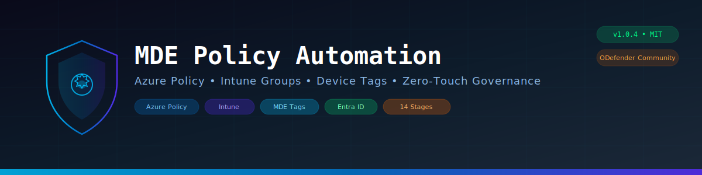

<div align="center">



<br/>

[](CHANGELOG.md)
[](LICENSE)
[](https://github.com/PowerShell/PowerShell)
[](https://learn.microsoft.com/azure/governance/policy/)
[](https://github.com/rfranca777/odefender-community)

<br/>

### Deploy. Govern. Organize. Relax.

**Stop creating Intune groups manually. Stop clicking through the MDE portal.**  
**Let Azure Policy enforce it — automatically, for every VM, in every subscription.**

<br/>

</div>

---

## ⚡ The 30-Second Pitch

You have **multiple Azure subscriptions** with Windows VMs spread everywhere. Microsoft Defender for Endpoint sees them — but the MDE portal is a mess:

- All servers dumped in one giant, unsorted Device Inventory? 😬
- No Device Groups, so you can't apply differentiated AV/ASR policies? 😤
- New VMs appear without tags, and nobody notices for weeks? 🤦
- Intune groups out of sync with Azure resources? 🫠
- Manual portal work every time a new subscription is onboarded? 💀

**MDE Policy Automation fixes all of this. One script. 14 stages. Fully autonomous.**

```
┌──────────────────────────────────────────────────────────────────────────────────┐
│                                                                                  │
│    ███╗   ███╗██████╗ ███████╗    ██████╗  ██████╗ ██╗     ██╗ ██████╗██╗   ██╗ │
│    ████╗ ████║██╔══██╗██╔════╝    ██╔══██╗██╔═══██╗██║     ██║██╔════╝╚██╗ ██╔╝ │
│    ██╔████╔██║██║  ██║█████╗      ██████╔╝██║   ██║██║     ██║██║      ╚████╔╝  │
│    ██║╚██╔╝██║██║  ██║██╔══╝      ██╔═══╝ ██║   ██║██║     ██║██║       ╚██╔╝   │
│    ██║ ╚═╝ ██║██████╔╝███████╗    ██║     ╚██████╔╝███████╗██║╚██████╗   ██║    │
│    ╚═╝     ╚═╝╚═════╝ ╚══════╝    ╚═╝      ╚═════╝ ╚══════╝╚═╝ ╚═════╝   ╚═╝    │
│                                                                                  │
│    ┌──────────────────────────────────────────────────────────────────────┐       │
│    │  ⚙️  Azure Policy — DeployIfNotExists for MDE Device Tags           │       │
│    │  👥  Entra ID Security Groups — Auto-sync VMs + Arc Machines        │       │
│    │  🏢  Intune Device Management — Groups always in sync               │       │
│    │  🛡️  MDE Device Groups — Differentiated policies per environment   │       │
│    │  🤖  Azure Automation — Hourly sync, zero human intervention        │       │
│    └──────────────────────────────────────────────────────────────────────┘       │
│                                                                                  │
│    v1.0.4 │ 14-Stage Full Automation │ MIT License │ PowerShell 5.1+             │
│                                                                                  │
└──────────────────────────────────────────────────────────────────────────────────┘
```

---

## 📊 The Impact

<table>
<tr>
<td width="50%" align="center">

### ⏱️ Before
**Manual Process**

</td>
<td width="50%" align="center">

### ⚡ After
**MDE Policy Automation**

</td>
</tr>
<tr>
<td>

❌ MDE portal: one big unsorted device list  
❌ No differentiated AV/ASR policies per environment  
❌ New VMs go untagged for days or weeks  
❌ Intune groups created manually, always out of sync  
❌ Every subscription = hours of portal clicking  
❌ No audit trail of device group membership  
❌ Azure Arc machines? Completely ignored  

</td>
<td>

✅ **MDE Device Groups** per subscription — automatic  
✅ Different policies for PROD vs DEV vs TEST  
✅ Azure Policy auto-tags VMs at creation time  
✅ Entra ID groups synced every hour via Automation  
✅ New subscription → run script → done in 10 minutes  
✅ Full audit: who's in which group, when, why  
✅ Azure Arc machines included automatically  

</td>
</tr>
</table>

> **What used to take a full day of portal clicking now takes ~10 minutes of automated deployment.**  
> *And then it runs itself. Every hour. Forever. While you hunt threats instead.*

---

## ✨ What Gets Deployed (14 Stages)

This is not a script — it's a **fully autonomous deployment pipeline**:

| Stage | What Happens | Azure Resource |
|-------|-------------|----------------|
| 1 | 🔐 Authentication & subscription selection | Azure CLI context |
| 2 | 🏷️ Intelligent naming based on subscription | Convention: `rg-mde-{sub}`, `aa-mde-{sub}`, etc. |
| 3 | 📦 Resource Group with 8 corporate tags | `Microsoft.Resources/resourceGroups` |
| 4 | 👥 Entra ID Security Group creation | `Microsoft Graph API` |
| 5 | ⚙️ Automation Account provisioning | `Microsoft.Automation/automationAccounts` |
| 6 | 🔑 Managed Identity (Zero Trust) | `SystemAssigned` identity + retry logic |
| 7 | 🛡️ RBAC Reader role assignment | Subscription-scoped Reader |
| 8 | 📡 Graph API permissions | `Group.ReadWrite.All`, `Device.Read.All` |
| 9 | 📚 Az.Accounts module installation | PowerShell Gallery → Automation |
| 10 | 📜 Runbook creation & publishing | VM ↔ Entra ID sync logic |
| 11 | ⏰ Schedule + Job Schedule linking | Hourly execution |
| 12 | 📋 Azure Policy for VM tagging | `DeployIfNotExists` policy |
| 13 | 🖥️ MDE Device Group instructions | Auto-generated HTML guide |
| 14 | 🏷️ MDE Machine Tags via API | App Registration + OAuth2 + auto-tagging |

> **Each stage validates before proceeding. If something fails, you get a clear error with a suggested fix.**

---

## 🏗️ How It Works

```
┌───────────────────────────────────────────────────────────────────────────────┐
│                    MDE Policy Automation — Architecture                        │
├───────────────────────────────────────────────────────────────────────────────┤
│                                                                               │
│   ┌──────────────┐                                                            │
│   │  You run the │                                                            │
│   │  script ONCE │                                                            │
│   └──────┬───────┘                                                            │
│          │                                                                    │
│          ▼                                                                    │
│   ┌──────────────────────────────────────────────────────────────────────┐    │
│   │  STAGE 1-3: Foundation                                               │    │
│   │  Azure CLI auth → Naming convention → Resource Group                 │    │
│   └──────────────────────────────────────────────────────────────────────┘    │
│          │                                                                    │
│          ▼                                                                    │
│   ┌──────────────────────────────────────────────────────────────────────┐    │
│   │  STAGE 4-8: Identity & Permissions                                   │    │
│   │  Entra Group → Automation Account → Managed Identity → RBAC → Graph  │    │
│   └──────────────────────────────────────────────────────────────────────┘    │
│          │                                                                    │
│          ▼                                                                    │
│   ┌──────────────────────────────────────────────────────────────────────┐    │
│   │  STAGE 9-11: Automation Engine                                       │    │
│   │  Az.Accounts module → Runbook (VM↔Entra sync) → Hourly Schedule     │    │
│   └──────────────────────────────────────────────────────────────────────┘    │
│          │                                                                    │
│          ▼                                                                    │
│   ┌──────────────────────────────────────────────────────────────────────┐    │
│   │  STAGE 12-14: Policy & Tagging                                       │    │
│   │  Azure Policy (DeployIfNotExists) → MDE Device Groups → MDE API Tags│    │
│   └──────────────────────────────────────────────────────────────────────┘    │
│          │                                                                    │
│          ▼                                                                    │
│   ┌──────────────────────────────────────────────────────────────────────┐    │
│   │  RUNS AUTOMATICALLY EVERY HOUR 🔄                                    │    │
│   │  Runbook: Discovers VMs → Matches Entra devices → Syncs group       │    │
│   │  Policy: New VM created → Extension deployed → Tag configured        │    │
│   │  MDE: Tag syncs → Device Group updated → Correct policies applied    │    │
│   └──────────────────────────────────────────────────────────────────────┘    │
│                                                                               │
└───────────────────────────────────────────────────────────────────────────────┘
```

---

## 📁 Project Structure

```
MDE-PolicyAutomation/
├── 📄 README.md                            ← You are here
├── 📄 CHANGELOG.md                         ← Version history
│
├── 🚀 full-automation/
│   └── 🔧 Deploy-MDE-Automation.ps1       ← 14-STAGE AUTONOMOUS DEPLOYMENT
│
├── 📋 azure-policy/
│   ├── 📄 policy-definition.json           ← Azure Policy (DeployIfNotExists)
│   └── 🔧 Set-MDEDeviceTag.ps1            ← Registry config script (runs on VMs)
│
├── docs/
│   ├── 📄 QUICK-START.md                   ← 5-minute quick start
│   ├── 📄 ARCHITECTURE.md                  ← Technical architecture details
│   └── 📄 MANUAL-DEPLOY.md                 ← Step-by-step manual deployment
│
└── assets/
    └── 🎨 banner.svg                       ← Project banner
```

---

## 🚀 Quick Start

### Option A: Full Automation (Recommended)

**One script deploys everything — 14 stages, fully autonomous:**

```powershell
# 1. Clone the repo
git clone https://github.com/rfranca777/MDE-PolicyAutomation.git
cd MDE-PolicyAutomation

# 2. Login to Azure
az login

# 3. Run the full automation
.\full-automation\Deploy-MDE-Automation.ps1
```

The script will:
- List your subscriptions and let you choose
- Generate intelligent naming for all resources
- Deploy all 14 stages with validation at each step
- Open an HTML guide for MDE Device Group creation (manual portal step)
- Optionally auto-tag all existing MDE devices

### Option B: Azure Policy Only (Lightweight)

**Just deploy the Azure Policy — no Automation Account, no groups:**

```powershell
# 1. Upload the tag script to a Storage Account
$ctx = (Get-AzStorageAccount -ResourceGroupName "YourRG" -Name "yourstorage").Context
New-AzStorageContainer -Name "mde-scripts" -Context $ctx -Permission Blob
Set-AzStorageBlobContent -File ".\azure-policy\Set-MDEDeviceTag.ps1" `
    -Container "mde-scripts" -Blob "Set-MDEDeviceTag.ps1" -Context $ctx

# 2. Create the policy
New-AzPolicyDefinition -Name "mde-device-tag" `
    -Policy ".\azure-policy\policy-definition.json"

# 3. Assign the policy
New-AzPolicyAssignment -Name "mde-tag-prod" `
    -PolicyDefinition (Get-AzPolicyDefinition -Name "mde-device-tag") `
    -Scope "/subscriptions/YOUR-SUB-ID" `
    -AssignIdentity -Location "eastus" `
    -PolicyParameterObject @{
        tagValue = "PRODUCTION"
        scriptUri = "https://yourstorage.blob.core.windows.net/mde-scripts/Set-MDEDeviceTag.ps1"
    }
```

> **📖 Full guide**: [docs/QUICK-START.md](docs/QUICK-START.md) | [docs/ARCHITECTURE.md](docs/ARCHITECTURE.md)

---

## 🏷️ How Device Tags Work

```
  Azure Policy deploys Custom Script Extension on VM
                     │
                     ▼
  Set-MDEDeviceTag.ps1 configures Windows Registry:
  ┌────────────────────────────────────────────────────────────┐
  │  HKLM:\SOFTWARE\Policies\Microsoft\                       │
  │    Windows Advanced Threat Protection\DeviceTagging        │
  │      Group = "PRODUCTION"    ← Your tag value              │
  └────────────────────────────────────────────────────────────┘
                     │
                     ▼
  MDE Agent reads registry key on next check-in (15-30 min)
                     │
                     ▼
  Tag appears in MDE Portal → Device Groups → Differentiated policies!
```

### Use Cases

| Scenario | Tag Strategy | Result |
|----------|-------------|--------|
| 🏢 **Environment segmentation** | `PROD`, `DEV`, `TEST`, `STAGING` | Different AV/ASR policies per env |
| 📋 **Compliance requirements** | `PCI`, `HIPAA`, `SOC2` | Compliance-based security groups |
| 🌍 **Geographic distribution** | `US-EAST`, `EU-WEST`, `APAC` | Region-specific policies |
| 👥 **Team ownership** | `Engineering`, `Finance`, `HR` | Team-based device management |
| 🖥️ **Server roles** | `SQL`, `WEB`, `DC`, `APP` | Role-specific hardening |

---

## 🔄 The Automation Loop

Once deployed, the system runs itself:

```
┌──────────────┐    ┌──────────────┐    ┌──────────────┐    ┌──────────────┐
│  New VM       │    │  Azure       │    │  Registry    │    │  MDE Portal  │
│  Created      │───▶│  Policy      │───▶│  Configured  │───▶│  Tag Synced  │
│  in Azure     │    │  Triggers    │    │  on VM       │    │  (15-30 min) │
└──────────────┘    └──────────────┘    └──────────────┘    └──────────────┘
                                                                    │
                                                                    ▼
┌──────────────┐    ┌──────────────┐    ┌──────────────┐    ┌──────────────┐
│  Correct AV/ │    │  MDE Device  │    │  Entra ID    │    │  Runbook     │
│  ASR Policy  │◀───│  Group       │◀───│  Group Sync  │◀───│  (Hourly)    │
│  Applied     │    │  Matches     │    │  Updated     │    │  Discovers   │
└──────────────┘    └──────────────┘    └──────────────┘    └──────────────┘
```

> **No human intervention. No portal clicking. No "I forgot to tag that new server."**

---

## ⚙️ Requirements

| Requirement | Details |
|-------------|---------|
| **Azure CLI** | 2.0+ ([Install](https://aka.ms/installazurecli)) |
| **PowerShell** | 5.1+ (7.x recommended) |
| **Azure Permissions** | Contributor + Policy Contributor on subscription |
| **Entra ID Permissions** | `Group.ReadWrite.All`, `Device.Read.All` (for full automation) |
| **MDE Permissions** | `Machine.ReadWrite.All` (for API tagging — Stage 14) |
| **Platforms** | Windows, Linux, Cloud Shell |

---

## 🔍 Troubleshooting

<details>
<summary><strong>Policy not applying to VMs</strong></summary>

- Verify the Managed Identity has `Virtual Machine Contributor` role
- Check the script URI is accessible (Blob container must be public or use SAS token)
- Review Activity Log: `Azure Portal → Monitor → Activity Log → Filter by Policy`
</details>

<details>
<summary><strong>Tag not appearing in MDE portal</strong></summary>

- Allow 15-30 minutes for MDE agent sync
- Verify MDE agent is running: `Get-Service -Name Sense`
- Check registry: `Get-ItemProperty "HKLM:\SOFTWARE\Policies\Microsoft\Windows Advanced Threat Protection\DeviceTagging"`
</details>

<details>
<summary><strong>Managed Identity propagation errors</strong></summary>

- Microsoft recommends 30 seconds for AAD propagation
- The script has built-in retry logic (3 attempts with 20s delays)
- If it persists, wait 2-3 minutes and run: `az automation account update --name <aa> --resource-group <rg> --set identity.type=SystemAssigned`
</details>

<details>
<summary><strong>Extension fails to install on VM</strong></summary>

- Check VM has internet connectivity
- Verify CustomScriptExtension is not already installed with a different name
- Review logs: `C:\WindowsAzure\Logs\Plugins\Microsoft.Compute.CustomScriptExtension\`
</details>

---

## 🔮 Roadmap

| Feature | Description | ETA |
|---------|-------------|-----|
| 🐧 **Linux Policy Support** | Extend Azure Policy to cover Linux VMs (bash-based tag script) | Q3 2025 |
| 🤖 **AI Agent Integration** | Autonomous agent for Device Group optimization and policy tuning | Q4 2025 |
| 📊 **Compliance Dashboard** | HTML/PDF report with policy compliance status per subscription | Q3 2025 |
| 🔗 **Multi-Tenant Support** | Lighthouse-compatible deployment across managed tenants | 2026 |

---

## 🤝 Contributing

Contributions welcome! See [CONTRIBUTING.md](CONTRIBUTING.md) for guidelines.

**Key areas where we'd love help:**
- 🐧 Linux support for the device tag script (bash/shell equivalent)
- 📊 Enhanced HTML reporting
- 🧪 Pester tests for validation stages
- 📖 Documentation improvements

---

## 👤 Author

**Rafael França**  
**Customer Success Architect — Cyber Security @ Microsoft**

Building and sharing open-source tools that help security teams achieve more — because knowledge shared is defense multiplied.

> *"Every hour an analyst spends clicking through portals is an hour NOT spent hunting threats. That's the gap we close."*

[](https://www.linkedin.com/in/rfranca777/)
[](mailto:rafael.franca@live.com)
[](https://github.com/rfranca777/odefender-community)

> *This project is part of [ODefender Community](https://github.com/rfranca777/odefender-community) — open-source security automation for the real world.*

---

## 📜 License

MIT License — see [LICENSE](LICENSE) for details.

---

## ⚠️ Disclaimer

This project is **not officially supported by Microsoft**. It is an independent community contribution by a Microsoft employee, shared under MIT license. Use at your own risk. Always test in a non-production environment first.

Microsoft Defender for Endpoint, Azure, Intune, and related trademarks are property of Microsoft Corporation.

---

<div align="center">

**Part of the [ODefender Community](https://github.com/rfranca777/odefender-community) initiative.**

*From manual chaos to automated governance — one policy at a time.*

<br/>

[](https://github.com/rfranca777/MDE-PolicyAutomation)

</div>
